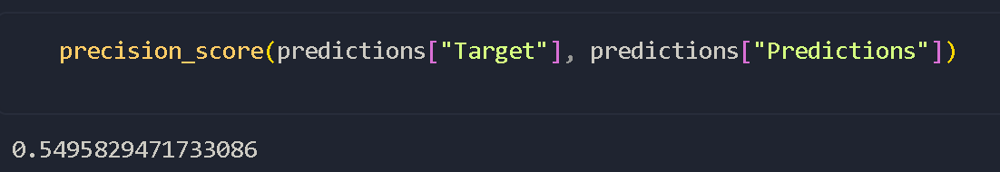
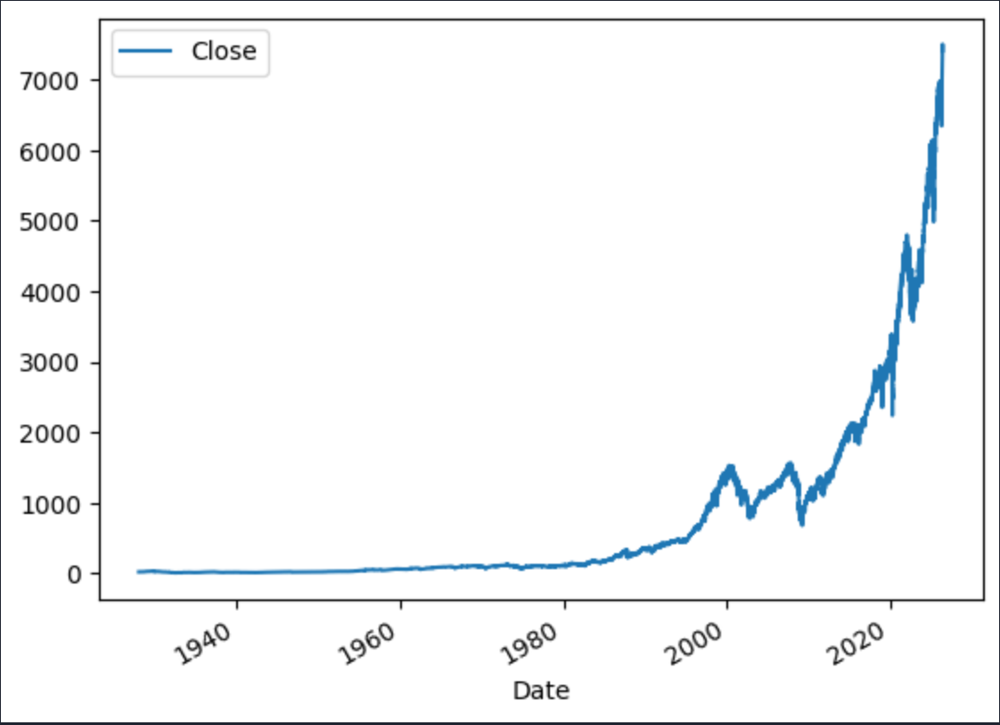
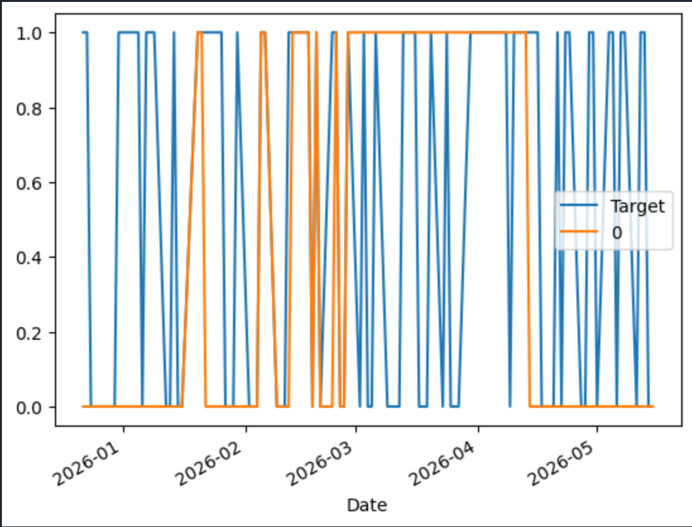

## Portfolio

---

### About Me

I'm Sreeyuth Jakka, a 9th grade high school student with a passion for **coding**, **Artificial Intelligence**, and **Machine Learning**. I'm always learning and building new things — this portfolio is a collection of my projects and work.

---

### Projects

#### [ AI Jarvis Voice Assistant](https://github.com/Sreeyuth3030/Sreeyuth3030.github.io/tree/main/jarvis/JarvisVoice)
Jarvis is a voice-activated AI assistant that listens, thinks, and talks back and is powered by Claude AI. If you
point your camera at anything and it'll tell you what it's looking at, out loud. You can ask it questions and it gives you answers. It's
built with JavaScript and Node.js, with help from AI.

---

#### [ NBA Team Info App](https://studio.code.org/projects/applab/9259932c-2d36-4fc2-a665-b97a8932f9ff)
Built for my AP Computer Science Principles Exam, the app lets you look up any 2019 NBA team and 
get their conference, championship wins, and home arena. it's Made in Code.org App Lab using JavaScript and a drag-and-drop interface.
[App Interface](

---

#### [ S&P 500 Stock Market Predictor](https://github.com/Sreeyuth3030/Sreeyuth3030.github.io/tree/main/stock%20market-%20predictor)

A machine learning model that predicts whether the S&P 500 will go up or down the next trading day. It's
Trained on 24,000+ days of data using a Random Forest Classifier. My model achhieved a 55% precision. It's
Built with Python, yfinance, pandas, and scikit-learn.

<!-- 
To add a project, use this format:

#### [Project Title](link-to-project)
A short description of what the project does and what technologies you used.

---
-->

---

### Skills

- Python
- JavaScript
- Git & GitHub
- Exploring: Machine Learning, AI

---

### Contact

Feel free to reach out or follow my work:
- **GitHub:** [Sreeyuth3030](https://github.com/Sreeyuth3030)

---

*Portfolio built with GitHub Pages · [evanca/quick-portfolio](https://github.com/evanca/quick-portfolio)*
